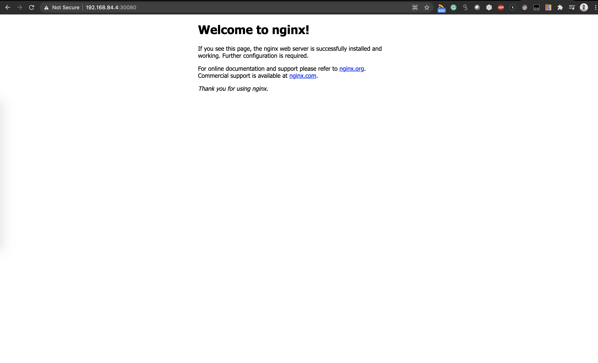

# ansible-kubernetes-vagrant
A local Kubernetes deployment using Vagrant and Ansible playbooks.
This is based on the  `Ansible for DevOps` book by Jeff Geerling.

The goal is to create 3 Kubernetes ready Debian VMs (1 master and 2 nodes), 
in order to be able to run Kubernetes tests or labs locally. 

After the Vagrant provisioning and ansible provisioning finish we will have 3 VMs: 
* master.k8s.test, ip: 192.168.84.2
* node1.k8s.test, ip: 192.168.84.3
* node2.k8s.test, ip: 192.168.84.4

We can then ssh to any VM with the credentials `root/root`:
```
ansible-kubernetes-vagrant$ ssh root@192.168.84.2

root@master:~# kubectl get nodes
NAME     STATUS   ROLES    AGE   VERSION
master   Ready    master   89m   v1.13.8
node1    Ready    <none>   88m   v1.13.8
node2    Ready    <none>   88m   v1.13.8

root@master:~# kubectl get pods --all-namespaces
NAMESPACE     NAME                             READY   STATUS    RESTARTS   AGE
kube-system   coredns-54ff9cd656-2hsh4         1/1     Running   0          89m
kube-system   coredns-54ff9cd656-rh78k         1/1     Running   0          89m
kube-system   etcd-master                      1/1     Running   0          88m
kube-system   kube-apiserver-master            1/1     Running   0          88m
kube-system   kube-controller-manager-master   1/1     Running   0          88m
kube-system   kube-flannel-ds-amd64-8x9sc      1/1     Running   0          89m
kube-system   kube-flannel-ds-amd64-cs6dl      1/1     Running   0          89m
kube-system   kube-flannel-ds-amd64-hp8hp      1/1     Running   0          88m
kube-system   kube-proxy-hvvvw                 1/1     Running   0          88m
kube-system   kube-proxy-mg854                 1/1     Running   0          89m
kube-system   kube-proxy-q9kwk                 1/1     Running   0          89m
kube-system   kube-scheduler-master            1/1     Running   0          88m
```
# Installation:
## Prerequisite:
* Ansible
* Ansible galaxy
* Vagrant
* VirtualBox
  
## Commands: 
1. Install the required roles
```
ansible-galaxy install -r requirements.yml 
```
2. Create the VMs
```
vagrant up
```
3. Run the ansible playbook to provision the VMs
```
ansible-playbook -i inventory.yml provision.yml
```


 
Tested with the following versions:
* Ansible 2.10.5
* Vagrant 2.2.7
* VirtualBox 6.0.12
* macOS Catalina 10.15.7


Don't forget to destroy the vagrant VM once done with your tests.
```
vagrant destroy
rm -rf .vagrant
```

# Example: 
As an example, 2 different files are copied into the master nodes during the ansible provisioning. 
* nginx-deployment.yaml --> nginx deployment (3 replicas running on port 80)
* nginx-service.yaml --> nginx service (with nodeport 30080)


On the Kubernetes master, we can then deploy them with the following commands: 
```
root@master:~# kubectl apply -f nginx-deployment.yaml
deployment.apps/nginx created
root@master:~# kubectl apply -f nginx-service.yaml
service/nginx created
```

The service and the pods should be ready: 
```
root@master:~# kubectl get all
NAME                         READY   STATUS    RESTARTS   AGE
pod/nginx-7db75b8b78-5tp9v   1/1     Running   0          4m46s
pod/nginx-7db75b8b78-7kmb7   1/1     Running   0          4m46s
pod/nginx-7db75b8b78-hljqh   1/1     Running   0          4m46s

NAME                 TYPE        CLUSTER-IP     EXTERNAL-IP   PORT(S)        AGE
service/kubernetes   ClusterIP   10.96.0.1      <none>        443/TCP        19m
service/nginx        NodePort    10.96.66.198   <none>        80:30080/TCP   83s

NAME                    READY   UP-TO-DATE   AVAILABLE   AGE
deployment.apps/nginx   3/3     3            3           4m46s

NAME                               DESIRED   CURRENT   READY   AGE
replicaset.apps/nginx-7db75b8b78   3         3         3       4m46s
```

You can then access the Nginx welcome page by visiting either of the following URL: 
* http://192.168.84.2:30080/
* http://192.168.84.3:30080/
* http://192.168.84.4:30080/


